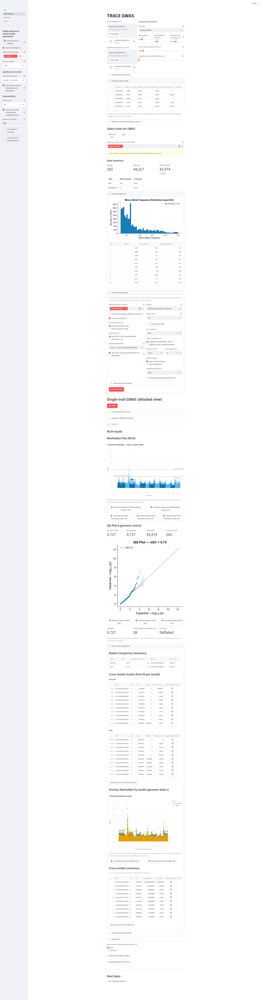
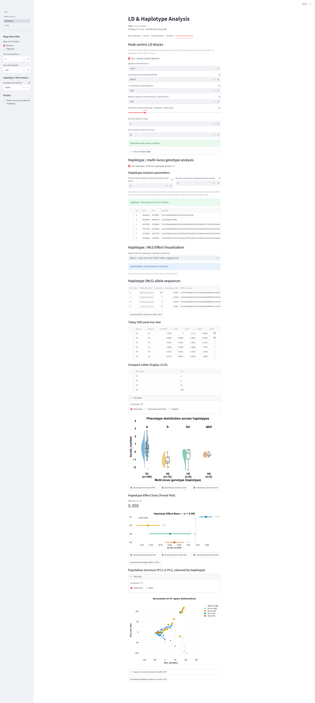

# TRACE: An Automated End-to-End GWAS Framework for Crop Breeding

TRACE takes a VCF and a phenotype file and returns annotated candidate loci. One command runs QC, LOCO-based GWAS, LD block detection, haplotype testing, gene annotation, and subsampling stability in a single pass. It was built around tomato and pepper diversity panels, but works with any diploid VCF.

> Developed at the [Center of Plant Systems Biology and Biotechnology (CPSBB)](https://cpsbb.eu/), Plovdiv, Bulgaria, as part of the **NATGENCROP** project (EU Horizon Europe).

---

[](https://doi.org/10.5281/zenodo.19678860)
[](https://opensource.org/licenses/MIT)
[](https://www.python.org/downloads/)
---

## Screenshots

**GWAS Analysis** — One-click pipeline with QC, Manhattan/QQ plots, subsampling stability, and cross-model consensus:



**LD & Haplotype Analysis** — Peak-centric LD block detection, haplotype effect testing, and forest plots:



---

## Overview

A single run covers every step:

```
VCF + Phenotypes → QC → GWAS (LOCO-MLM / MLMM / FarmCPU) → LD blocks → Gene annotation
                             ↓                                        ↓
                    Subsampling stability                       Haplotype testing
```

---

## Features

### GWAS Analysis
- **Mixed Linear Model (MLM)** via [FastLMM](https://github.com/fastlmm/FaST-LMM)
- **LOCO** (Leave-One-Chromosome-Out) kinship to avoid proximal contamination
- **MLMM** (Multi-Locus Mixed Model) 
- **TRACE-FarmCPU** — a FarmCPU (Liu et al., 2016) variant. Pseudo-QTNs are validated with forward-selection MLM, and the final scan uses LOCO kinship.
- **Cross-model consensus table** 
- **OLS effect sizes** (Beta, SE, t-statistic) 
- **Rank-based inverse normal transform** (INT) for skewed traits
- **Freedman-Lane permutation testing** (1,000+ permutations) preserving covariate structure
- **Manhattan plots and QQ plots**
- **M_eff** (Li & Ji, 2005) 
- **Genomic inflation factor** (λGC) 
- **User-selectable significance threshold** — M_eff (default), Bonferroni, or FDR
- **Imputation quality awareness** — automatic detection of INFO/DR2/R2/AR2 fields from imputed VCFs with configurable filtering threshold

### Subsampling GWAS Stability
- **Subsampling resampling without replacement**: recomputes GRM, and PCs for each subsample
- Optional **LOCO kinship** per subsampling iteration
- **Block-level aggregation**: discovery frequency, lead SNP consistency, and stability metrics
- Quantifies **signal reproducibility** across subsets of accessions

### LD & Haplotype Analysis
- **Graph-based LD block detection** 
- Haplotype grouping via multi-locus genotype (MLG) 
- Block-level nested F-test with **Freedman-Lane permutation p-values**
- **η² (eta-squared)** effect size for haplotype groups
- **LD decay curves** per chromosome 

### Gene Annotation
- Automatic annotation of LD blocks using bundled gene models and functional descriptions
- Overlapping gene detection for blocks within gene bodies
- **Flanking gene reporting** (nearest 2 upstream + 2 downstream within 500 kb) for intergenic blocks
- Summary tables with gene IDs, descriptions, and distances

---

## Quick Start

```bash
# 1. Clone and install
git clone https://github.com/IoannisPerachoritis-hub/TRACE.git
cd TRACE
pip install -r requirements.txt
# Or install as a package (enables the `trace-gwas` CLI entry point):
#   pip install -e .

# 2. Launch the web app
streamlit run app.py

# 3. Try the example dataset (simulated by examples/simulate_example.py)
#    bash examples/run_example.sh
#    — or upload examples/example.vcf.gz and examples/example_pheno.csv in the
#      web app, select trait "Trait1" → "One-Click Full Analysis".
```

Or use the **CLI** for batch processing:

```bash
trace-gwas \
    --vcf examples/example.vcf.gz \
    --pheno examples/example_pheno.csv \
    --trait Trait1 \
    --output results/
```

Run `trace-gwas --help` for the full list of arguments. If not installed via pip, use `python cli.py` instead.

### CLI ↔ Web UI parity

Every analysis surfaced in the one-click web pipeline has a corresponding
CLI flag, so headless / HPC runs produce the same artifacts as the UI.

| Capability                              | Web UI page              | CLI flag(s)                                               |
|-----------------------------------------|--------------------------|-----------------------------------------------------------|
| MLM (LOCO) GWAS                         | GWAS Analysis            | `--model mlm` (default), `--no-loco` to disable           |
| MLMM                                    | GWAS Analysis            | `--models mlm,mlmm`                                       |
| TRACE-FarmCPU                           | GWAS Analysis            | `--models mlm,farmcpu`                                    |
| Cross-model consensus                   | GWAS Analysis            | automatic when ≥ 2 models requested (`CrossModel_Consensus.csv`) |
| Auto-PC selection (band)                | GWAS Analysis            | `--pc-strategy band` (default), `--n-pcs INT` to override |
| QC: MAF / MAC / missingness / INFO      | GWAS Analysis            | `--maf`, `--mac`, `--miss`, `--info`                      |
| Significance threshold                  | GWAS Analysis            | `--sig-rule {meff,bonferroni,fdr}`                        |
| LD blocks + haplotype testing           | LD Analysis              | `--ld-blocks`, `--haplotype-test`                         |
| Gene annotation                         | LD Analysis              | `--annotate`, `--gene-window-kb`                          |
| Subsampling stability                   | GWAS Analysis            | `--subsample`, `--n-subsamples`, `--retain-frac`          |
| Reproducible RNG                        | (deterministic by build) | `--seed INT` (default 42)                                 |
| HTML report                             | GWAS Analysis            | enabled by default; suppress with `--no-report`           |
| Plots (Manhattan / QQ / heatmaps)       | GWAS, LD pages           | enabled by default; suppress with `--no-plots`            |
| Export QC matrices for cross-tool runs  | (not in UI)              | `--export-qc`                                             |

Deep-dive interactive features (per-block LD heatmaps, decay curves) live
in the LD Analysis page and have no CLI counterpart by design — the CLI
emits the underlying CSVs so the same plots can be regenerated externally.

---

## Installation

### Requirements

- **Python ≥ 3.11** (tested on 3.11 and 3.12)
- Works on Linux, macOS, and Windows

### Setup

```bash
git clone https://github.com/IoannisPerachoritis-hub/TRACE.git
cd TRACE
pip install -r requirements.txt
```

Verify the installation:

```bash
python -c "import streamlit, fastlmm; print('TRACE dependencies OK')"
```

Then launch the web interface:

```bash
streamlit run app.py
```

### Key Dependencies

```
streamlit>=1.38         # Interactive web UI
fastlmm>=0.6.12         # Mixed linear model engine
pandas>=2.2             # Data manipulation
numpy>=1.26,<3          # Numerical computation
scipy>=1.13,<2          # Statistical tests
statsmodels>=0.14       # OLS statistics
matplotlib>=3.9         # Static plots (LD decay, heatmaps)
plotly>=5.18            # Interactive plots (Manhattan, QQ, heatmaps)
scikit-allel>=1.3.13    # VCF parsing and allele processing
```

See `requirements.txt` for the complete pinned dependency list. For bit-reproducible installs matching the manuscript benchmarks, use `pip install -r requirements.txt -c constraints.txt`, which pins every transitive numerical dependency to the exact version used in CI.

### Docker

A Dockerfile is provided for containerized deployment.

```bash
# Build the image
docker build -t trace-gwas .

# Run the Streamlit UI (default)
docker run -p 8501:8501 trace-gwas

# Run the CLI inside the container
docker run --entrypoint trace-gwas trace-gwas \
    --vcf /app/examples/example.vcf.gz \
    --pheno /app/examples/example_pheno.csv \
    --trait Trait1 --output /app/results/

# Mount local data for CLI analysis
docker run -v $(pwd)/data:/data --entrypoint trace-gwas trace-gwas \
    --vcf /data/my_genotypes.vcf.gz \
    --pheno /data/my_pheno.csv \
    --trait MyTrait --output /data/results/
```

---

## Project Structure

```
TRACE/
│
├── app.py                              # Main entry point (front page + project management)
├── cli.py                              # CLI batch mode (headless GWAS pipeline)
├── annotation.py                       # Gene annotation and LD decay
├── pyproject.toml                      # Packaging and version metadata
├── requirements.txt                    # Minimum version floors for pip install
├── constraints.txt                     # Exact pins for reproducible CI/manuscript builds
├── Dockerfile                          # Containerised deployment image
├── LICENSE                             # MIT
├── README.md                           # This file
├── CHANGELOG.md                        # Release notes
├── CITATION.cff                        # Citation metadata (used by GitHub/Zenodo)
├── CONTRIBUTING.md                     # Development setup + PR workflow
├── docs/                               # README assets (screenshots)
├── .github/workflows/                  # GitHub Actions CI (test.yml)
│
├── pages/
│   ├── GWAS_analysis.py                # GWAS analysis page (MLM, LOCO, MLMM, FarmCPU, subsampling)
│   ├── LD_Analysis.py                  # LD blocks, haplotypes, annotation, decay
│   ├── z_Help.py                       # In-app help and quick start
│   └── _ld_tabs/                        # LD page submodules
│       ├── __init__.py                 # LDContext dataclass
│       ├── tab_genome_wide.py          # Peak-centric LD block table
│       ├── tab_block_heatmaps.py       # Block-level LD visualization
│       ├── tab_gene_annotation.py      # Gene annotation within blocks
│       └── tab_decay.py                # LD decay curves
│
├── gwas/                               # Core statistical modules
│   ├── __init__.py
│   ├── models.py                       # MLM, MLMM, OLS effects, BIC proxy, auto PC selection
│   ├── kinship.py                      # GRM construction, LOCO kernels, LD pruning
│   ├── qc.py                           # Quality control pipeline (MAF, MAC, missingness, INFO score)
│   ├── ld.py                           # r², LD decay, graph-based block detection
│   ├── haplotype.py                    # Haplotype GWAS, Freedman-Lane permutation, η²
│   ├── subsampling.py                  # Subsampling GWAS stability, block-level aggregation
│   ├── plotting.py                     # Manhattan, QQ, λGC, M_eff
│   ├── reports.py                      # HTML report generator
│   ├── utils.py                        # PhenoData/CovarData, rank INT, imputation
│   ├── io.py                           # VCF/genotype I/O utilities
│   ├── stability.py                    # GWAS stability metrics
│   └── templates/
│       └── report.html.j2             # Jinja2 report template
│
├── utils/                              # Auxiliary utilities
│   ├── pub_theme.py                    # Publication-ready plot theme (Matplotlib + Plotly)
│   └── species_files.py               # Species-specific file paths and gene models
│
├── tests/                              # Automated test suite (367 tests)
│   ├── conftest.py                     # Shared fixtures
│   ├── test_ld.py                      # r², LD blocks, IoU, decay, SNP membership
│   ├── test_models.py                  # OLS, F-test, one-hot encoding, auto PC
│   ├── test_haplotype.py               # Block GWAS, Freedman-Lane, η²
│   ├── test_kinship.py                 # GRM construction, standardization
│   ├── test_qc.py                      # Allele freq, AF masks, call rate
│   ├── test_plotting_stats.py          # λGC, r² to lead SNP, M_eff
│   ├── test_stability.py              # GWAS stability metrics
│   ├── test_utils.py                   # Mean imputation, rank INT, seeds
│   ├── test_annotation.py             # Chr normalization, LD block annotation
│   ├── test_gwas_integration.py       # End-to-end GWAS, FarmCPU, MLMM, consensus
│   ├── test_cli.py                     # CLI batch mode arg parsing
│   ├── test_cli_e2e.py                 # CLI pipeline integration tests
│   ├── test_reports.py                 # HTML report generation, sig labels
│   ├── test_info_scores.py             # Imputation quality (INFO/DR2/R2) extraction + e2e VCF tests
│   ├── test_subsampling.py            # Subsampling aggregation, block-level stability
│   ├── test_io.py                      # VCF I/O, genotype loading
│   ├── test_upload_edge_cases.py       # BOM, ID normalization, encoding edge cases
│   ├── test_pipeline_stages.py         # Pipeline stage integration
│   └── test_null_calibration.py        # End-to-end λGC calibration check (CI gate)
│
├── data/                               # Bundled gene models + annotations
│   ├── Sol_genes_SL3.csv               # Tomato SL3.1 gene coordinates
│   ├── SL3.1_descriptions.txt          # Tomato SL3.1 functional descriptions
│   ├── Sol_genes.csv                   # Tomato SL4 / ITAG4.0 gene coordinates
│   ├── ITAG4.0_annotation.txt          # Tomato ITAG4.0 functional descriptions
│   ├── cann_gene_model.csv             # Pepper gene coordinates
│   └── cann_gene_annotation.txt        # Pepper functional descriptions
│
├── examples/                           # Synthetic quick-start tutorial dataset
│   ├── simulate_example.py             # Generates example.vcf.gz + example_pheno.csv
│   ├── example.vcf.gz                  # Simulated genotypes (60 samples × 150 SNPs, 3 chromosomes)
│   ├── example_pheno.csv               # Matching phenotype file (trait "Trait1")
│   ├── run_example.sh                  # One-command end-to-end example run
│   └── README.md                       # Example-specific usage notes
│
├── benchmarks/                         # Simulation + real-data benchmarking
│   ├── README.md                       # Benchmark reproduction guide (start here)
│   ├── simulation/                     # Power/FDR simulation (9 scenarios × 100 reps)
│   ├── plink_qc/                       # PLINK QC comparison
│   ├── qc_data/                        # Post-QC genotype matrices for benchmark scripts
│   ├── results/                        # Concordance tables vs GAPIT3 / rMVP
│   ├── plots/                          # Benchmark figure outputs
│   ├── make_qc_data.sh                 # Regenerates qc_data/ from source VCFs
│   └── reproduce.sh                    # End-to-end reviewer reproduction script
│
└── .streamlit/                         # Streamlit theme configuration
```

---

## Input Data

### Genotype Data
- **VCF format** (`.vcf` or `.vcf.gz`)
- Biallelic SNPs recommended
- Missing data handled internally (mean imputation for GRM, pairwise-complete for LD)
- Imputed VCFs supported — INFO/DR2/R2/AR2 quality fields auto-detected and optionally filtered

### Phenotype Data
- CSV with columns: sample ID + numeric trait columns
- ID column auto-detected (`Genotype`, `ID`, `Line`, `Sample`, `Accession`)
- Optional rank-based inverse normal transform (INT) for non-normal traits

### Gene Annotation (optional)
- **Sol_genes_SL3.csv** (default) or **Sol_genes.csv** (SL4): columns `CHROM, START, END, STRAND, GENE`
- **SL3.1_descriptions.txt** (default) or **ITAG4.0_annotation.txt** (SL4): tab-separated `gene_id\tdescription`
  - SL3.1 gene model matches Varitome / SL2.5 VCF coordinates; SL4 matches ITAG4.0 assemblies

### Species & Gene Model Support

TRACE ships with bundled gene models for two Solanaceae species:

| Species | Gene model | Assembly | Source |
|---------|-----------|----------|--------|
| Tomato (*S. lycopersicum*) | SL3.1 (default) | GCF_000188115.5 | NCBI RefSeq |
| Tomato (*S. lycopersicum*) | ITAG4.0 (SL4 option) | SL4.0 | Sol Genomics Network |
| Pepper (*C. annuum*) | CDS gene coordinates | UCD10Xv1.1 | Pepper genome consortium |

**Using TRACE with other species:** TRACE works with any diploid VCF. For species beyond tomato and pepper, supply a tab-delimited gene coordinate file with columns: `chr`, `start`, `end`, `gene_id`, `description`. Load it via the Gene Annotation upload in the UI or `--genes` on the CLI.

**Chromosome naming:** common prefixes (`chr`, `SL4.0ch`, `Ca`, `Os`, `Gm`, etc.) are stripped and entries that resolve to positive integers are kept. The chromosome count comes from the data. Anything that does not resolve to an integer is mapped to `"ALT"` and dropped from LOCO kernels and LD pruning. If no chromosomes resolve, the error prints a sample of the original CHROM values. Implementation: `_clean_chr_series()` in `gwas/io.py`.

---

## Usage Guide

### 1. GWAS Analysis

Upload VCF + phenotype CSV. Configure QC thresholds (MAF, MAC, missingness), select association models (MLM / MLMM / FarmCPU), and set parameters.

**Two analysis modes:**

- **Manual workflow** — Set the PC count via slider, click "Run GWAS", then explore results section by section (Manhattan, QQ, multi-model, subsampling). Each section has its own download buttons.

- **One-Click Full Analysis** — open the "One-Click Full Analysis" section, pick the models (default: MLM + FarmCPU) and a significance threshold (M_eff / Bonferroni / FDR), then click "Run Full Analysis". The pipeline chains auto PC selection → MLM GWAS → MLMM/FarmCPU (if selected) → Manhattan + QQ plots → LD blocks → HTML report → ZIP bundle. A live status indicator shows progress. The ZIP contains:
  - `tables/` — GWAS results CSV (with `Significant_Bonf` and `Significant_Meff` columns), multi-model CSVs, PC selection lambda table
  - `figures/` — Manhattan plot, QQ plot (300 DPI PNG)
  - `report.html` — self-contained HTML report with all results

Results include the Manhattan and QQ plots, the significant-SNP table, OLS effect sizes, λGC, and the M_eff threshold. Subsampling GWAS is optional and reports signal stability.

### 2. LD & Haplotype Analysis

After GWAS, open the LD page. LD blocks are detected with a graph-based algorithm using adaptive r² thresholds. Haplotype groups are tested against the trait with a nested F-test and Freedman-Lane permutation p-values. η² reports the variance explained by each haplotype group, and LD decay is computed per chromosome.

### 3. Gene Annotation

Upload a gene model file and optionally a gene descriptions file (bundled files auto-load by species and genome build). The module reports overlapping genes (with functional descriptions) and flanking genes for intergenic blocks.

### 4. Subsampling GWAS Stability

Enable subsampling GWAS to check signal reproducibility. Each iteration draws 80% of accessions without replacement, recomputes the GRM and PCs, and re-runs the MLM. Discovery frequency per SNP and per LD block flags which signals survive sample perturbation. LOCO kinship per iteration is optional and removes proximal contamination from the stability estimate.

### 5. CLI Batch Mode

TRACE ships a command-line interface for headless runs on HPC clusters or in batch scripts.

```bash
trace-gwas --vcf data.vcf.gz --pheno pheno.csv --trait Yield --output results/
```

Run `trace-gwas --help` for all available arguments including model selection, QC thresholds, subsampling settings, and significance criteria. Use `python cli.py` if not installed via pip.

---

## Testing

The test suite covers the core statistical functions:

```bash
# Run full test suite
python -m pytest tests/ -v

# Run specific module tests
python -m pytest tests/test_ld.py -v
```

| Module              | Tests | Coverage                                         |
|---------------------|-------|--------------------------------------------------|
| `gwas/ld.py`        | 31    | r², LD blocks, IoU, decay, SNP membership        |
| `gwas/models.py`    | 39    | OLS effects, F-test, one-hot encoding, auto PC selection |
| `gwas/haplotype.py` | 14    | Block GWAS, Freedman-Lane, η²                    |
| `gwas/kinship.py`   | 15    | GRM construction, standardization, LOCO          |
| `gwas/qc.py`        | 22    | Allele frequency, AF masks, call rate, INFO score, chr guards |
| `gwas/plotting.py`  | 15    | λGC, r² to lead SNP, M_eff                      |
| `gwas/reports.py`   | 18    | HTML report generation, sig labels, per-model sections |
| `gwas/io.py`        | 43    | VCF I/O, genotype loading, INFO score extraction, multi-species chr parsing |
| `gwas/subsampling.py` | 9   | Subsampling aggregation, block-level stability   |
| `gwas/stability.py` | 16    | GWAS stability metrics                           |
| `gwas/utils.py`     | 11    | Mean imputation, rank INT, seeds                 |
| `annotation.py`     | 39    | Chr normalization, LD block annotation, IoU      |
| `cli.py`            | 29    | CLI arg parsing, defaults, model selection, e2e  |
| Upload/edge cases   | 15    | BOM handling, ID normalization, encoding edge cases |
| Integration         | 45    | End-to-end GWAS, FarmCPU, MLMM, consensus, pipeline stages, INFO scores |
| Null calibration    | 2     | End-to-end λGC in [0.85, 1.15] on permuted null, zero genome-wide hits |

Edge cases validated: all-NaN columns, monomorphic SNPs, single haplotype groups, too few samples, perfect LD (r²=1), intergenic SNPs.

---

## Citation

If you use TRACE in your research, please cite:

> Perachoritis, I., Vatov, E., Alseekh, S., Gechev, T., & Rai, A. (2026).
> TRACE: An Automated End-To-End GWAS Framework for Crop Breeding.
> *Bioinformatics*. Submitted.
> DOI: [10.5281/zenodo.19678860](https://doi.org/10.5281/zenodo.19678860)
>
> See [CITATION.cff](CITATION.cff) for citation metadata.

---

## License

This project is licensed under the MIT License. See [LICENSE](LICENSE) for details.

---

## Acknowledgments

- **European Regional Development Fund** — Program "Research Innovation and Digitalisation for Smart Transformation" 2021-2027, Grant No. BG16RFPR002-1.014-0003-C01
- **NATGENCROP Project** — HORIZON-WIDERA-2022-TALENTS-01, No. 101087091
- **Center of Plant Systems Biology and Biotechnology (CPSBB)**, Plovdiv, Bulgaria

