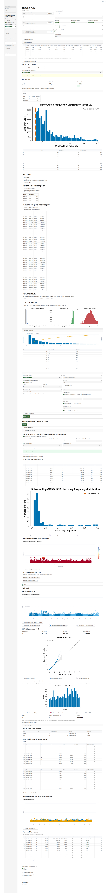
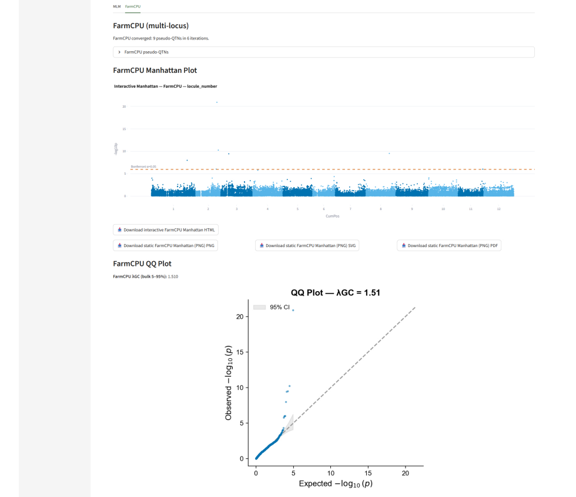
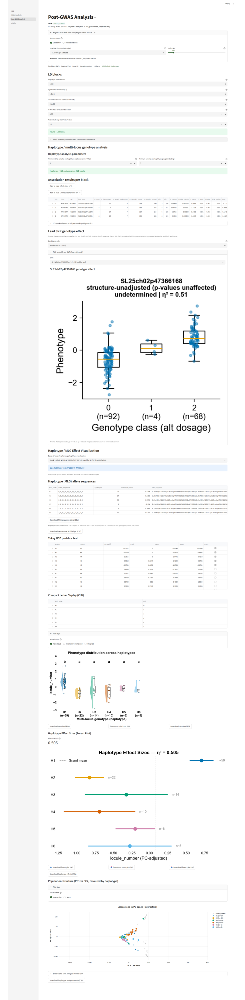
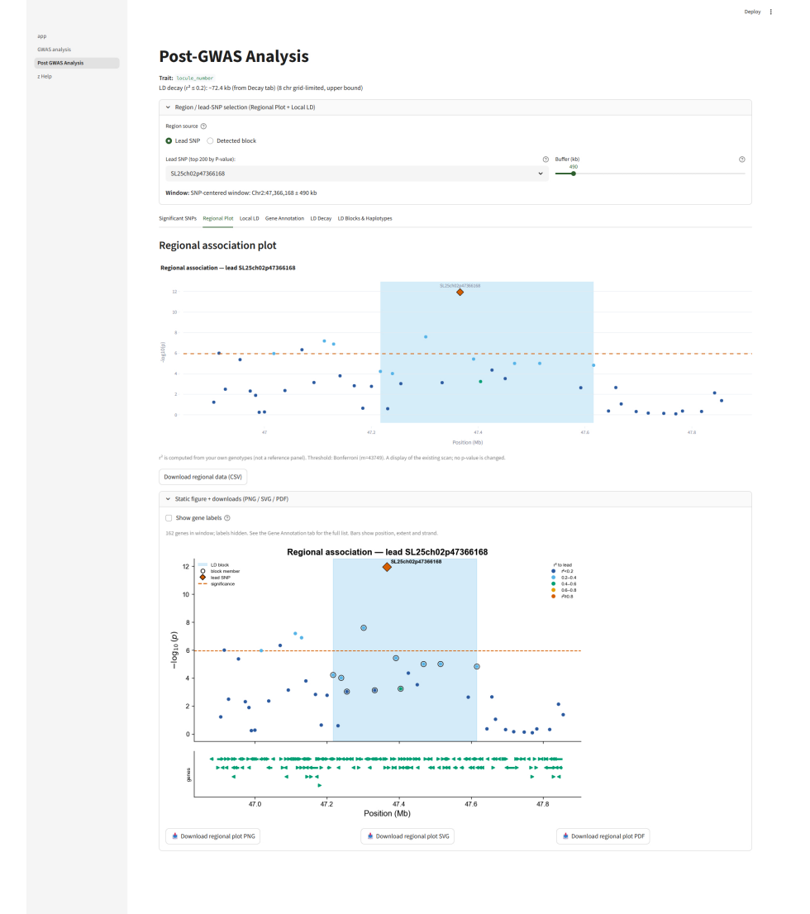
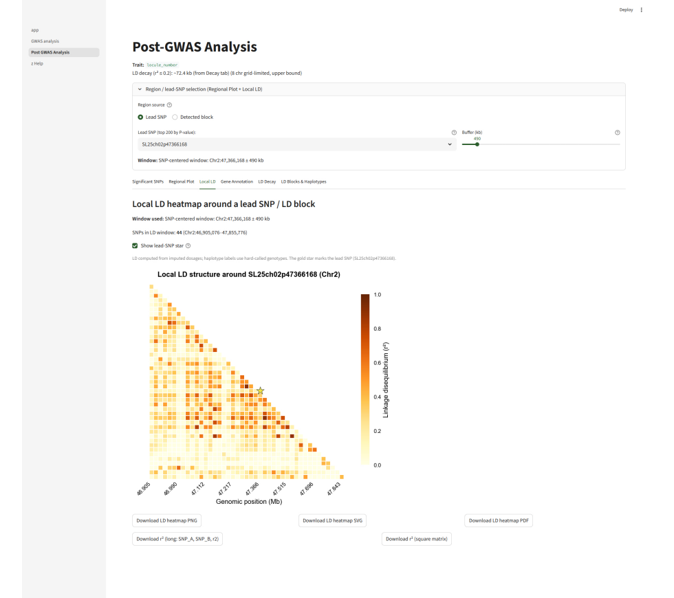

# TRACE: An Automated, Extensive GWAS Framework for Crop Breeding

Crop genetics is well supplied with software for the association scan itself. The step that remains largely
manual is the transition from significant markers to a small set of annotated candidate intervals. TRACE
addresses that step: it takes a VCF and a phenotype file and runs QC, LOCO-based GWAS, LD block detection,
haplotype testing, gene annotation and subsampling stability in a single command. Built around tomato
diversity panels, it works with any diploid VCF.

> Developed at the [Center of Plant Systems Biology and Biotechnology (CPSBB)](https://cpsbb.eu/), Plovdiv,
> Bulgaria, as part of the **NATGENCROP** project (EU Horizon Europe).

[](https://doi.org/10.5281/zenodo.19678860)
[](https://opensource.org/licenses/MIT)
[](https://www.python.org/downloads/)

---

## Screenshots

**GWAS Analysis** — one-click pipeline with QC, Manhattan/QQ plots, subsampling stability, and cross-model
consensus:



**TRACE-FarmCPU** — multi-locus scan with REML-optimised pseudo-QTN selection and a fixed-effect final test:



**Post-GWAS Analysis** — peak-centric LD block detection, haplotype effect testing (Tukey HSD + compact
letter display, raincloud, forest plot), and haplotype-coloured PCA:



**Regional association plot** — physical position against association statistic, coloured by r² to the lead
marker computed from the analysed genotypes; the detected LD block is shaded, with an overlapping gene track
beneath:



**Local LD heatmap** — lead-SNP-centric heatmap with a configurable buffer; pick a detected block via the
region selector:



---

## Getting started

Three routes. **Pick the one whose requirement you already meet.**

### Run it without installing anything — needs only Docker

```bash
docker run -p 8501:8501 ghcr.io/ioannisperachoritis-hub/trace:latest
```

Open <http://localhost:8501>, upload a VCF and a phenotype table, and download the results archive before
closing the container — nothing persists between sessions. No Python, no compiler, no clone.

Once pulled, `docker run` uses the local copy and never checks for a newer release, so update explicitly:

```bash
docker pull ghcr.io/ioannisperachoritis-hub/trace:latest
```

For a headless CLI run, mount a working directory. Files written there belong to your user, not root:

```bash
docker run --rm -v "$(pwd)/data:/data" --entrypoint trace-gwas \
    ghcr.io/ioannisperachoritis-hub/trace:latest \
    --vcf /data/my_genotypes.vcf.gz --pheno /data/my_pheno.csv \
    --trait MyTrait --output /data/results/
```

### Install without administrator rights — needs only [uv](https://docs.astral.sh/uv/)

uv is a single binary that installs into your home directory and fetches Python itself, so this route works
on a managed machine where you cannot install Docker.

```bash
git clone https://github.com/IoannisPerachoritis-hub/TRACE.git && cd TRACE
uv venv --python 3.11
source .venv/bin/activate        # Windows: .venv\Scripts\activate
uv pip install -e .
streamlit run app.py
```

### Install with pip — if you already have Python 3.11+

See [Installation](#installation) below. This is the documented installation route.

### Then try the bundled example

50 samples, 510 SNPs, three chromosomes — enough to see every stage run in under a minute.

```bash
bash examples/run_example.sh
```

Or upload `examples/example.vcf.gz` and `examples/example_pheno.csv` in the web app, select trait
`Trait1`, and choose **One-Click Full Analysis**. The equivalent CLI call:

```bash
trace-gwas --vcf examples/example.vcf.gz --pheno examples/example_pheno.csv \
    --trait Trait1 --output results/
```

Run `trace-gwas --help` for every flag, or `python cli.py` if you have not installed the package.

---

## What it does

A single run covers every step:

```
VCF + Phenotypes → QC → GWAS (LOCO-MLM / MLMM / FarmCPU) → LD blocks → Gene annotation
                             ↓                                        ↓
                    Subsampling stability                       Haplotype testing
```

### Association testing

- **Mixed linear model (MLM)** via [FaST-LMM](https://github.com/fastlmm/FaST-LMM), with **LOCO**
  (leave-one-chromosome-out) kinship to avoid proximal contamination
- **MLMM** (multi-locus mixed model) and **TRACE-FarmCPU** — a FarmCPU (Liu et al., 2016) implementation in
  which pseudo-QTNs are selected by REML-optimised bin selection at the published bound and the final scan is
  a classical fixed-effect (OLS) test with no kinship fitted
- **Cross-model consensus table** when two or more models are requested
- **User-supplied covariates** (`--covar`, or upload in the web app) combined with any principal components
  into a single fixed-effect design matrix, retained at every forward-selection iteration
- **Principal-component spectrum diagnostics** — the eigenvalue spectrum and each component's correlation
  with the trait are reported to inform the analyst's choice; the count is specified, never selected
  automatically
- **User-selectable significance threshold** — Bonferroni (default), M_eff (Li & Ji, 2005, LD-aware), FDR, or
  an explicit p-value
- **OLS effect sizes** (beta, SE, t), **rank-based inverse normal transform** for skewed traits, Manhattan and
  QQ plots, and the genomic inflation factor λGC

### Quality control and missing data

- MAF, MAC, per-variant and per-sample missingness, with adjustable thresholds
- **Imputation quality awareness** — INFO / DR2 / R2 / AR2 fields are detected automatically in imputed VCFs
  and can be filtered on
- **Two imputation options** — mean imputation, or **LD-kNNi** (LD-weighted k-nearest-neighbour) for
  missing calls
- A quality-control report with heterozygosity, F_IS and trait distributions

### Post-GWAS analysis

- **Graph-based LD block detection** with a within-block correlation requirement, seeded from significant
  markers
- Haplotype grouping by multi-locus genotype, tested with a block-level nested F-test and
  **Freedman-Lane permutation** p-values (1,000 permutations by default), with **η²** effect sizes and
  Tukey HSD post-hoc comparisons
- **Regional association plots** and **local LD heatmaps** around a lead marker or a detected block, with r²
  computed from the analysed genotypes rather than a reference panel
- **LD decay curves** per chromosome

### Subsampling stability

- Resampling without replacement, **recomputing the GRM and the principal components inside every replicate**
  from the subsampled individuals alone, with optional per-iteration LOCO kinship
- Discovery frequency per marker and per LD block, so a signal's dependence on particular accessions is
  visible

### Gene annotation

- Overlapping genes with functional descriptions for blocks inside gene bodies, and **flanking genes**
  (nearest two upstream and downstream within 500 kb) for intergenic blocks
- Bundled tomato gene models, or supply your own

---

## CLI ↔ Web UI parity

Every analysis surfaced in the one-click web pipeline has a corresponding CLI flag, so headless and batch
runs produce the same artifacts as the interface.

| Capability                              | Web UI page              | CLI flag(s)                                               |
|-----------------------------------------|--------------------------|-----------------------------------------------------------|
| MLM (LOCO) GWAS                         | GWAS Analysis            | `--model mlm` (default), `--no-loco` to disable           |
| MLMM                                    | GWAS Analysis            | `--model mlm mlmm`                                        |
| TRACE-FarmCPU                           | GWAS Analysis            | `--model mlm farmcpu`                                     |
| Cross-model consensus                   | GWAS Analysis            | automatic when ≥ 2 models requested (`CrossModel_Consensus.csv`) |
| User covariates                         | GWAS Analysis            | `--covar FILE` (combined with any PCs into one design matrix) |
| PC covariates + spectrum diagnostics    | GWAS Analysis            | `--n-pcs INT` (fixed; default 0); the report includes the eigenvalue spectrum |
| QC: MAF / MAC / missingness / INFO      | GWAS Analysis            | `--maf`, `--mac`, `--miss`, `--ind-miss`, `--info-thresh` |
| Significance threshold                  | GWAS Analysis            | `--sig-thresh {meff,bonferroni,fdr,<p-value>}` (default bonferroni) |
| LD blocks + haplotype testing           | Post-GWAS Analysis       | `--ld-r2`, `--ld-seed-p`, `--ld-top-n`, `--hap-perms`     |
| Gene annotation                         | Post-GWAS Analysis       | `--gene-model`, `--genome-build`; `--no-annotation` to skip |
| Subsampling stability                   | GWAS Analysis            | `--subsampling`, `--boot-reps`, `--boot-frac`             |
| Reproducible RNG                        | (deterministic by build) | `--seed INT` (default 42)                                 |
| HTML report                             | GWAS Analysis            | enabled by default; suppress with `--no-report`           |
| Plots (Manhattan / QQ / heatmaps)       | GWAS, LD pages           | enabled by default; suppress with `--no-plots`            |
| Export QC matrices for cross-tool runs  | (not in UI)              | `--export-qc`                                             |

Deep-dive interactive features — per-block LD heatmaps, decay curves, the regional plot — live in the
Post-GWAS Analysis page and have no CLI counterpart by design; the CLI emits the underlying CSVs so the same
plots can be regenerated externally.

---

## Documentation

- **[Quick-Start Tutorial](docs/tutorial.md)** — a walkthrough of both the CLI and the web app on the bundled
  example dataset.
- **[CLI Reference](docs/cli_reference.md)** — every command-line flag, generated from the parser.
- **[Output Files](docs/outputs.md)** — the post-GWAS CSVs written by the LD, haplotype and regional-plot
  tabs. The GWAS, LD-block, haplotype, subsampling and consensus columns are documented in the **CSV Column
  Glossary** on the app's **Help & Reference** page.
- **[Gene-Model Upload](docs/gene_model_upload.md)** — the format for supplying your own gene annotation.

---

## Installation

### Requirements

- **Python ≥ 3.11** (tested on 3.11 and 3.12)
- Linux, macOS, or Windows

### Setup

```bash
git clone https://github.com/IoannisPerachoritis-hub/TRACE.git
cd TRACE
pip install -r requirements.txt
```

Verify it:

```bash
python -c "import streamlit, fastlmm; print('TRACE dependencies OK')"
```

Then launch the web interface:

```bash
streamlit run app.py
```

Installing as a package (`pip install -e .`) additionally provides the `trace-gwas` command-line entry point.

### Key dependencies

```
streamlit>=1.38         # Interactive web UI
fastlmm>=0.6.12         # Mixed linear model engine
pandas>=2.2             # Data manipulation
numpy>=1.26,<3          # Numerical computation
scipy>=1.13,<2          # Statistical tests
statsmodels>=0.14       # OLS statistics
matplotlib>=3.9         # Static plots (LD decay, heatmaps)
plotly>=5.18            # Interactive plots (Manhattan, QQ, heatmaps)
scikit-allel>=1.3.13    # VCF parsing and allele processing
```

`requirements.txt` holds the complete dependency list as **minimum version floors**. For reproducible
installs matching the manuscript benchmarks, add the exact pins used in CI:

```bash
pip install -r requirements.txt -c constraints.txt
```

### Docker

The published image needs no build; see [Getting started](#getting-started). To build it yourself:

```bash
docker build -t trace .
docker run -p 8501:8501 trace
```

---

## Repository layout

```
TRACE/
├── app.py, cli.py                    # web app and CLI entry points
├── gwas/                             # statistical core: QC, kinship, models, LD, haplotypes, subsampling
├── pages/                            # Streamlit pages and the Post-GWAS tab modules
├── annotation.py, data/              # gene annotation and the bundled tomato gene models
├── utils/                            # publication plot theme, species file resolution
├── tests/                            # automated test suite (see Testing)
├── examples/                         # synthetic quick-start dataset
├── benchmarks/                       # simulation and real-data benchmarking (start at benchmarks/README.md)
├── docs/                             # tutorial, CLI reference, output glossary, screenshots
├── launchers/                        # one-click launch scripts for non-terminal users
└── Dockerfile, pyproject.toml, requirements.txt, constraints.txt
```

---

## Input data

### Genotypes

- **VCF** (`.vcf` or `.vcf.gz`), biallelic SNPs recommended
- Genotypes are stored as alternate-allele counts (0, 1, 2 for a diploid); missing calls are filled by mean
  imputation or by LD-kNNi, and LD is computed pairwise-complete
- Imputed VCFs supported — INFO / DR2 / R2 / AR2 quality fields are auto-detected and optionally filtered

### Phenotypes

- CSV with a sample-ID column plus numeric trait columns
- The ID column is auto-detected (`Genotype`, `ID`, `Line`, `Sample`, `Accession`)
- Optional rank-based inverse normal transform for non-normal traits

### Gene annotation (optional)

| Species | Gene model | Assembly | Source |
|---------|-----------|----------|--------|
| Tomato (*S. lycopersicum*) | SL3.1 (default) | GCF_000188115.5 | NCBI RefSeq |
| Tomato (*S. lycopersicum*) | ITAG4.0 (SL4 option) | SL4.0 | Sol Genomics Network |

SL3.1 matches Varitome / SL2.5 VCF coordinates; SL4 matches ITAG4.0 assemblies. **Gene models and variant
coordinates must share an assembly build** — annotation against a mismatched build is positional rather than
coordinate-exact.

**Other species:** TRACE works with any diploid VCF. Supply a tab-delimited gene coordinate file with
columns `chr`, `start`, `end`, `gene_id`, `description` via the Gene Annotation upload or `--gene-model`.

**Chromosome naming:** common prefixes (`chr`, `SL4.0ch`, `Ca`, `Os`, `Gm`) are stripped and entries
resolving to positive integers are kept; the chromosome count comes from the data. Anything that does not
resolve is mapped to `"ALT"` and dropped from LOCO kernels and LD pruning. Implementation:
`_clean_chr_series()` in `gwas/io.py`.

---

## Usage guide

### 1. GWAS analysis

Upload a VCF and a phenotype CSV, set QC thresholds, and select models. Two modes:

- **Manual** — set the PC count, run the GWAS, then work through the results section by section, each with
  its own downloads.
- **One-Click Full Analysis** — pick the models (default MLM + FarmCPU) and a significance threshold, then
  run. The pipeline goes MLM → MLMM/FarmCPU → Manhattan and QQ plots → LD blocks → HTML report → ZIP, at the
  PC count you set (default 0; TRACE does not select principal components automatically, but the report
  includes the eigenvalue spectrum). The ZIP contains `tables/` (GWAS results with `Significant_Bonf` and
  `Significant_Meff` columns, per-model CSVs, the PC spectrum), `figures/` (300 DPI Manhattan and QQ), and a
  self-contained `report.html`.

### 2. Post-GWAS analysis

LD blocks are detected with a graph-based algorithm seeded from significant markers. Haplotype groups are
tested against the trait with a nested F-test and Freedman-Lane permutation p-values; η² reports the
variance explained. Regional plots and local LD heatmaps show the neighbourhood of a lead marker, and LD
decay is computed per chromosome.

### 3. Gene annotation

Upload a gene model and optionally a descriptions file (bundled files auto-load by species and build). The
module reports overlapping genes with functional descriptions, and flanking genes for intergenic blocks.

### 4. Subsampling stability

Each iteration draws 80% of accessions without replacement, recomputes the GRM and the principal components
from those individuals alone, and re-runs the MLM. Discovery frequency per marker and per block shows which
signals survive sample perturbation. Per-iteration LOCO kinship is optional.

### 5. CLI batch mode

```bash
trace-gwas --vcf data.vcf.gz --pheno pheno.csv --trait Yield --output results/
```

`trace-gwas --help` lists every argument. Use `python cli.py` if the package is not installed.

---

## Testing

Continuous integration runs the full suite on every push and pull request to `main`, under Python 3.11 and
3.12, with coverage measurement and a floor below which the build fails.

```bash
python -m pytest tests/ -v              # full suite
python -m pytest tests/test_ld.py -v    # one module
```

Edge cases covered include all-NaN columns, monomorphic SNPs, single haplotype groups, too few samples,
perfect LD (r² = 1) and intergenic SNPs.

<!-- BEGIN GENERATED: test-table (scripts/gen_test_table.py -- do not edit by hand) -->

| Module | Tests | What it exercises |
|--------|-------|-------------------|
| Genotype I/O & parsing | 74 | VCF/dosage parsing, INFO scores, upload edge cases |
| Quality control | 55 | MAF/missingness/MAC/heterozygosity filters, per-group QC, QC report |
| Imputation | 22 | mean and LD-kNNi imputation and its cache |
| Phenotype QC & transforms | 24 | normality diagnostics, transformations, embedded QC panel |
| Kinship (GRM / LOCO) | 15 | VanRaden GRM and leave-one-chromosome-out kernels |
| Association models | 22 | MLM / MLMM / FarmCPU scans and FarmCPU pseudo-QTN selection |
| Significance & multiple testing | 14 | M_eff / Bonferroni / FDR / custom-threshold rules |
| Covariates & PC diagnostics | 19 | user covariates and the PC eigenvalue-spectrum diagnostics |
| LD block detection | 47 | peak-centric LD block detection and merging |
| Haplotype testing | 49 | block haplotype effects, effect sizes, compact letter display |
| LD triage | 28 | coherence/haplotype triage layers, router and eta-squared comparability |
| Isolated-SNP rescue & significant-SNP table | 33 | unblocked-SNP intervals and the significant-SNP table |
| Regional & per-SNP visualisation | 47 | regional association plots, per-SNP boxplots, plotting stats, sample views |
| Gene annotation | 42 | LD-block gene annotation and gene-model summaries |
| Subsampling stability | 25 | bootstrap subsampling and stability metrics |
| HTML report | 24 | run-report assembly and section rendering |
| Command-line interface | 32 | CLI parsing, end-to-end runs, doc-to-parser flag parity |
| Web UI (Streamlit) | 15 | app-test coverage of the GWAS, Post-GWAS, help and landing pages |
| Pipeline integration | 30 | end-to-end GWAS pipeline and stage wiring |
| Golden regression & pinned defaults | 103 | byte-stable golden fixtures, the golden lock, and pinned signatures/defaults |
| Calibration & reproducibility | 8 | null-phenotype calibration and LOCO reproducibility |
| Utilities | 11 | shared helpers |

_Total: 739 tests. Line coverage: 75% (gwas + utils)._

<!-- END GENERATED: test-table -->

---

## Citation

If you use TRACE in your research, please cite:

> To be filled after acceptance.
>
> Software archive: [10.5281/zenodo.19678860](https://doi.org/10.5281/zenodo.19678860) — concept DOI,
> resolving to the latest archived version. Each release also carries its own version DOI.
>
> See [CITATION.cff](CITATION.cff) for citation metadata.

---

## License

MIT. See [LICENSE](LICENSE).

---

## Acknowledgments

- **European Regional Development Fund** — Program "Research Innovation and Digitalisation for Smart
  Transformation" 2021-2027, Grant No. BG16RFPR002-1.014-0003-C01
- **NATGENCROP Project** — HORIZON-WIDERA-2022-TALENTS-01, No. 101087091
- **Center of Plant Systems Biology and Biotechnology (CPSBB)**, Plovdiv, Bulgaria
